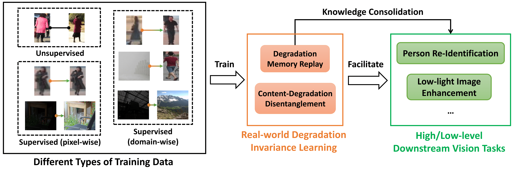

# Degradation-Invariant-Re-ID-pytorch
This repository contains the official implementation of the [IJCV 2022 paper](https://link.springer.com/article/10.1007/s11263-022-01666-w):
> Learning Degradation-Invariant Representation for Robust Real-World Person Re-Identification
<br>Yukun Huang<sup>1</sup>, [Xueyang Fu](https://xueyangfu.github.io/)<sup>1</sup>, Liang Li<sup>2</sup>, Zheng-Jun Zha<sup>1</sup><br>
> <sup>1</sup>University of Science and Technology of China &nbsp; <sup>2</sup>Institute of Computing Technology, Chinese Academy of
Sciences


 <!-- "[*Learning Degradation-Invariant Representation for Robust Real-World Person Re-Identification*](https://link.springer.com/article/10.1007/s11263-022-01666-w)". -->

## Introduction

We propose a real-world Degradation Invariance Learning (DIL)
framework, which can utilize training image pairs with different supervision types for content-degradation feature disentanglement. Using DIL as a proxy task can facilitate both low- and high-level downstream tasks such as person re-identification and low-light image enhancement.




## Dependencies
* Python 3.8
* PyTorch 1.8.0

## Dataset
Download the MLR-CUHK03 dataset and reorganize the folders as follows:<br>
```
├── resolution-reid
│   ├── MLR-CUHK03
│       ├── train
│       ├── val
│       ├── gallery
│       ├── query
│           ├── 0020
│               ├── 00020_c0_00000.jpg
│               ├── ...
```

## Model
Trained model are provided. You may download it from [Google Drive](https://drive.google.com/drive/folders/1anHkFyEJaQWRsbkmVFjZX9y71zzb7rCs?usp=sharing), then move the `outputs` folder to your project's root directory.

## Usage

### 1. Training
 
The first training stage aims to learn disentangled representations of image content and degradation, you can run:
 ```
 python train_dil.py --dataset mlr_cuhk03 --data_root path/to/resolution-reid/
 ```

The second training stage is for downstream tasks. For person Re-ID, you can run:
 ```
 python train_reid.py --dataset mlr_cuhk03 --data_root path/to/resolution-reid/ --teacher_root path/to/teacher/
 ```

The teacher model weights can be downloaded from [Google Drive](https://drive.google.com/drive/folders/1anHkFyEJaQWRsbkmVFjZX9y71zzb7rCs?usp=sharing).

### 2. Re-ID Evaluation
To evaluate the Re-ID model on the MLR-CUHK03 dataset, you can run:
```
python test_reid.py --dataset mlr_cuhk03 --data_root path/to/resolution-reid/
```
The Re-ID performance of our [provided model weights](https://drive.google.com/drive/folders/1anHkFyEJaQWRsbkmVFjZX9y71zzb7rCs?usp=sharing):

`Rank@1=91.8  Rank@5=98.6  Rank@10=99.3  Rank@20=99.5  mAP=94.8`

### 3. Visualization
You can run the following command to obtain visualization results of degradation manipulation:
```
python visualize.py
```

The visualization results of degradation swapping:


The visualization results of degradation memory replay:


## Citation
If you find the code useful, please kindly cite our works:
```BibTeX
@article{huang2022degradation,
  title={Learning Degradation-Invariant Representation for Robust Real-World Person Re-Identification},
  author={Huang, Yukun and Fu, Xueyang and Li, Liang and Zha, Zheng-Jun},
  journal={International Journal of Computer Vision},
  volume={130},
  number={11},
  pages={2770--2796},
  year={2022},
  publisher={Springer}
}

@inproceedings{huang2020degradation,
title={Real-World Person Re-Identification via Degradation Invariance Learning},
author={Huang, Yukun and Zha, Zheng-Jun and Fu, Xueyang and Hong, Richang and Li, Liang},
booktitle={Proceedings of the IEEE/CVF Conference on Computer Vision and Pattern Recognition},
pages={14084--14094},
year={2020}
}
```
